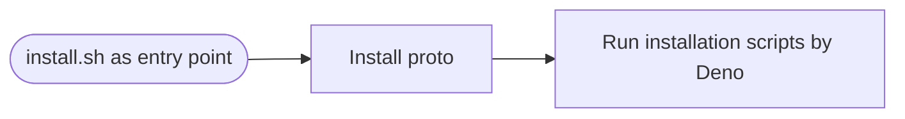

# :gear: Dotfiles

## :twisted_rightwards_arrows: Workflow



### install.sh

Just run `bin/install.sh`. It will automatically execute all subsequent
processes.

### Install proto

[proto](https://github.com/moonrepo/proto) is a modern version manager for
multiple programming languages.

### Run installation scripts by Deno

[Deno](https://deno.com/) installed by proto runs all configurattion setup
scripts.

## :wrench: Environment

|           |                       |
| --------- | --------------------- |
| OS (Base) | Linux (Ubuntu ^22.04) |
| Shell     | fish                  |

## Setup

```bash
# Clone this repository
git clone https://github.com/shunk-py/dotfiles.git
# Run install.sh
bash ./bin/install.sh
```
