# 🛠️ Kay's Dotfiles


[](https://deno.land)
[](https://ubuntu.com/)


Modern dotfiles setup powered by Deno and TypeScript for a streamlined
development environment.

## ✨ Features

- 🚀 **One-line installation** - Get started instantly with a single curl
  command
- 🦕 **Deno-powered** - All installation scripts written in TypeScript with
  [dax](https://github.com/dsherret/dax)
- 🔧 **Comprehensive tooling** - Pre-configured development tools and languages
- 🎨 **Fish shell** - Modern shell with powerful features and auto-completion
- 📝 **Neovim setup** - Optimized editor configuration
- 🎯 **VSCode integration** - Automatic extension installation and settings sync

## 🚀 Quick Start

### One-line installation (Recommended)

```bash
curl -fsSL https://raw.githubusercontent.com/k1-c/dotfiles/main/install.sh | bash
```

### Manual installation

```bash
git clone https://github.com/k1-c/dotfiles.git
cd dotfiles
bash ./install.sh
```

## 🔄 Installation Flow

```mermaid
flowchart TD
    A[install.sh] --> B[Install proto]
    B --> C[Install Deno via proto]
    C --> D[Run Deno installation scripts]
    D --> E[System dependencies]
    D --> F[Configuration symlinks]
    D --> G[VSCode extensions]
    D --> H[Nerd Fonts]
    E --> I[✅ Complete]
    F --> I
    G --> I
    H --> I
```



## 🛠️ What Gets Installed

### Development Languages & Tools

- **Languages**: Python (pyenv), Ruby (rbenv), Rust, Go, Node.js
- **Version Managers**: [proto](https://github.com/moonrepo/proto) for unified
  language management
- **Shell**: Fish shell with modern features
- **Editor**: Neovim with optimized configuration
- **Terminal**: Tmux for session management

### Development Tools

- **Git** with custom configuration
- **Docker** and Docker Compose
- **GitHub CLI** for seamless GitHub integration
- **Ripgrep**, **fzf**, **peco** for enhanced searching
- **ghq** for repository management

### Fonts & UI

- **Nerd Fonts** (Hack) for terminal icons
- **GitUI** for terminal-based Git interface
- **Ulauncher** application launcher configuration

## 📁 Project Structure

```
dotfiles/
├── install.sh              # Main installation entry point
├── lib/                     # Deno/TypeScript installation scripts
│   ├── install.ts          # Main orchestrator
│   ├── preinstall.ts       # System dependencies
│   ├── config.ts           # Configuration symlinks
│   ├── vscode.ts           # VSCode extensions
│   └── fonts.ts            # Font installation
├── config/                  # Configuration files
│   ├── fish/               # Fish shell config
│   ├── nvim/               # Neovim config
│   ├── git/                # Git config
│   ├── tmux/               # Tmux config
│   ├── vscode/             # VSCode settings
│   └── ...
└── deno.json               # Deno configuration
```

## 🎮 Available Commands

After installation, you can run individual components:

```bash
# Run full installation
deno task install

# Install system dependencies only
deno task preinstall

# Setup configuration symlinks only
deno task config

# Install VSCode extensions only
deno task vscode

# Install fonts only
deno task fonts

# Run tests  
deno test --allow-all

# Docker testing
deno task test:docker
deno task test:docker:integration
```

## 🖥️ Supported Environment

| Component     | Version/Details                 |
| ------------- | ------------------------------- |
| **OS**        | Linux (Ubuntu 22.04+)           |
| **Shell**     | Fish (default)                  |
| **Runtime**   | Deno (installed via proto)      |
| **Languages** | Python, Ruby, Rust, Go, Node.js |

## 🔧 Customization

### Adding New Configurations

1. Add your config files to the appropriate directory in `config/`
2. Update `lib/config.ts` to include symlink creation
3. Test with `deno task config`

### Adding New Tools

1. Add installation commands to `lib/preinstall.ts`
2. Test with `deno task preinstall`

### Modifying VSCode Extensions

Edit `config/vscode/User/extensions` and run `deno task vscode`

## 🧪 Testing

### Local Testing with Deno.test

Run the test suite to verify your installation:

```bash
# Run all tests
deno test --allow-all

# Run specific test file
deno test --allow-all tests/test.ts

# Run tests with verbose output
deno test --allow-all --reporter=verbose
```

### Docker Testing

Test the installation in a clean Docker environment:

```bash
# Basic Docker tests (build, config validation, etc.)
deno task test:docker

# Test individual components
deno task test:docker:components

# Full integration test (installs and validates everything)
deno task test:docker:integration

# Interactive testing environment
deno task test:docker:interactive
```

### Manual Docker Testing

```bash
# Build and run with docker-compose
cd tests/environment
docker-compose up --build dotfiles-test

# Interactive debugging
docker-compose run --rm dotfiles-dev bash
```

## 🤝 Contributing

1. Fork the repository
2. Create your feature branch
3. Test your changes with `deno test --allow-all` and Docker tests
4. Submit a pull request

## 📝 License

This project is open source and available under the MIT License.

## 🙏 Acknowledgments

- [proto](https://github.com/moonrepo/proto) - Universal version manager
- [dax](https://github.com/dsherret/dax) - Shell scripting for Deno
- [Fish Shell](https://fishshell.com/) - Smart and user-friendly shell
- [Neovim](https://neovim.io/) - Hyperextensible Vim-based text editor
